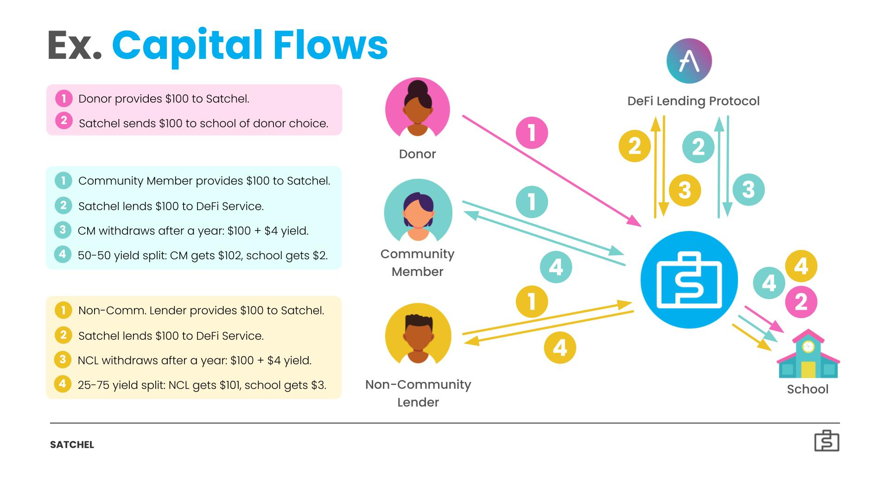

# Satchel

## Table of Contents

1. [Description](#Description)
2. [Features](#Features)
3. [Setup](#Setup)
4. [Demo](#Demo)
5. [License](#License)

## Description

[Satchel](http://satchel.finance) is a decentralized application that uplifts underbanked school communities by facilitating locally-governed projects and capital growth via DeFi-powered donations and financial primitives. Founded by 3 UC Berkeley Electrical Engineering & Computer Science students, Satchel began as a [collab](https://www.unicef.org/innovation/stories/generating-income-benefit-communities) between Blockchain at Berkeley and UNICEF. Satchel’s core features include savings accounts and loans for underbanked school communities via key DeFi protocols, splitting yield between individuals and schools for individual and local socioeconomic mobility, community governance over Satchel-wide decisions and locally-funded school projects, and tax-deductible contributions to school communities in need around the world.

$SATCH is a token we plan to allocate to stakeholders of the Satchel network. Donors receive an initial allocation of $SATCH upon donating, while community members and non-community lenders receive an initial allocation of $SATCH upon lending. $SATCH holds voting power, which subsequently instills local and global agency. On the local level, community members can use $SATCH to vote on school projects in their community. For instance, community members can now have a say in whether school funds generated by Satchel are directed towards school textbooks or healthy lunch options. In this way, residents inch towards self-governance — carving the direction of their communities and reclaiming agency from largescale institutions that have long been making these decisions for them. On the global level, all stakeholders can use $SATCH to vote on Satchel-wide decisions (such as whether Satchel should expand to schools within a new developing economy or which yield-bearing DeFi protocol to integrate) and parameters (such as the initial allocation amount of $SATCH). In this way, Satchel’s users help curate its future, defining core facets of their financial infrastructure.

Financial resources and governance paired together allow Satchel to leverage schools as a proxy for rerouting financial and governmental agency to communities on the individual, local, and global levels.

### Technical Architecture

- React.js and web3 for the frontend
- Aave as the the Ethereum-lending protocol to garner interest for users
- Solidity for smart contracts
- MetaMask for authentication

### Visualization of Primary Flow

## Features

### Current Features

Satchel currently has two user flows: That of the school and that of the community member.

#### User

- User can sign up and login with their MetaMask account.
- User can choose which school they are associated with.
- User can deposit assets from their personal wallet into Satchel such that it can garner interest over time.
- User can withdraw assets from their savings account in Satchel, at which point the garnered interest will be evenly split between the user and their associated school.
- User can see the current interest rate of Satchel on their Dashboard, which is updated upon withdrawals.
- User can see the exact amount of assets they have contributed to their local school.
- User can see the name of their local school.
- User can see the projects that their school is currently running and utilizing their contributions for.

#### School

- Multiple schools can sign up and login with their MetaMask accounts.
- School can withdraw assets that has been sent to the school from the garnered interest of its associated community members. Withdrawn funds go to the school’s wallet.
- School can create a new project that will be showcased to its community members.
- School can see current projects.

### Future Features

We plan to add the following improvements:

- User can take out loans from Satchel and redeem those loans.
- User maintains a credit rating that implicates their loan flexibility and is impacted by loan redemption timeliness.
- Add a flow for a non-community-member to be able to interact with Satchel and contribute to a school in a developing region.
- School projects are created with real data.
- Implement governance such that users can vote on which school projects are prioritized funding-wise.

### Video Demo

https://drive.google.com/file/d/1QZLnBp_bgxWfy5A656H2NElpQDETdfjT/preview

## License

    Copyright 2022 Satchel Labs

    Licensed under the Apache License, Version 2.0 (the "License");
    you may not use this file except in compliance with the License.
    You may obtain a copy of the License at

        http://www.apache.org/licenses/LICENSE-2.0

    Unless required by applicable law or agreed to in writing, software
    distributed under the License is distributed on an "AS IS" BASIS,
    WITHOUT WARRANTIES OR CONDITIONS OF ANY KIND, either express or implied.
    See the License for the specific language governing permissions and
    limitations under the License.
